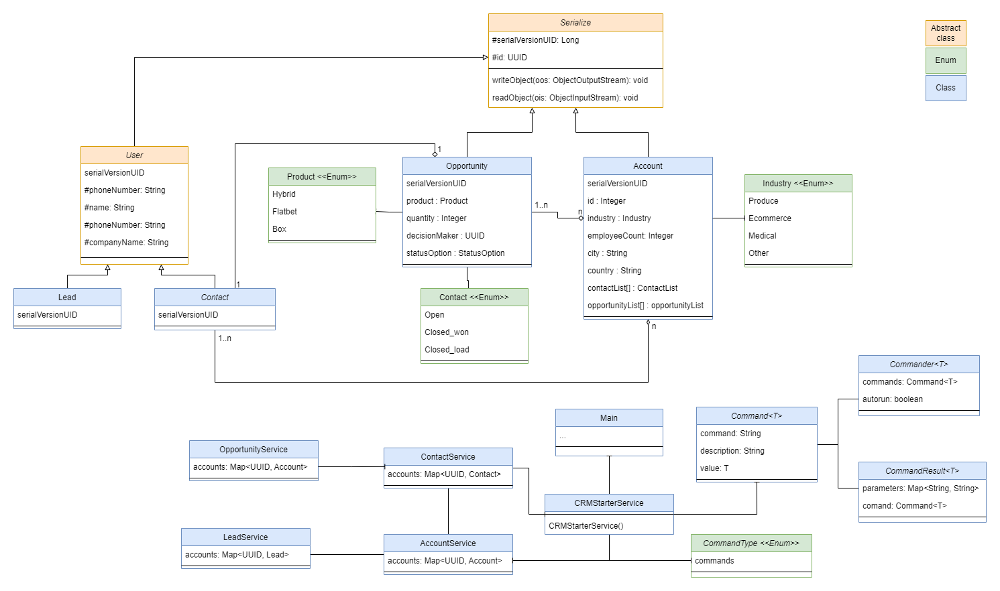
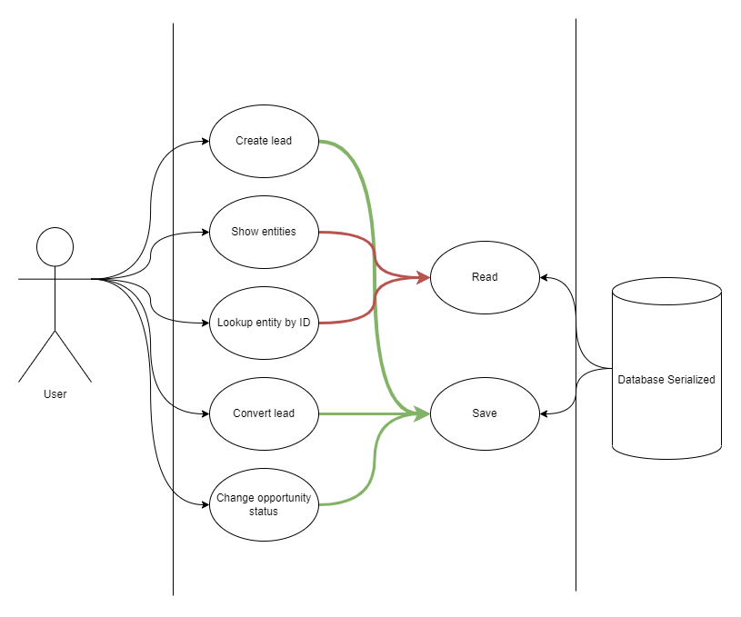

# RENUA Software CRM

### Introduction
Welcome to the RENUA Software CRM.
This is a simple CRM that allows you to manage your customers and their orders.
You can add, edit, delete and view your leads and customers.

The entire project is controlled by keyboard commands. The data is stored in a serialised database in a file "serialized-data.txt".
When running the project, the first recommended command to use is "help", which shows all possible commands to execute.

### UML Class Diagram

### UML Use Case Diagram

### Serialization
Serialization is the process of converting Java objects into a stream of bytes (array of bytes).
The stream of bytes can be transmitted through a network connection, stored in a database as a BLOB object or saved as a binary file.
The stored or transmitted stream of bytes can be reconstructed to Java object later.

To convert any objects of a class into a stream, a special permission has to be provided for that class.
Rather than defining it as a permission.
In Java, this permission is provided by implementing the interface java.io.Serializable.
This interface does not have any abstract methods.
Purpose of this interface is just indicating that, the object of this classes are allowed to convert into a stream of bytes.

We add a long variable serialVersionUID to the Serializable class.
This id is used to identify the exact class of byte stream, when the stream is converted back to the Java object.
The serialVersionUID is long number.

### Diagram folders
- **Commander**: Use to handle the command lines.
- **Enums**: Use to handle the fixed values.
- **Model**: Use to handle the data model.
- **Serialize**: Use to handle the data serialization.
- **Service**: Use to handle the service layer.
- **UserInput**: Use to handle the user inputs from command lines.

### How to use the software
Run the software and follow the instructions.
In the command line use *help* to see the available commands.
The basic functionalities are:
- Create a new lead.
- Show all the leads, contacts, opportunities and accounts saved in the software.
- Show the details of a lead, contact, opportunity or account.
- Convert a lead to an opportunity. Then the lead is converted to a contact and the account related with the contact is also created.
- Update the status of an opportunity.

Using the "help" command you can find the following commands:

    new lead                - Create a new lead
    show leads              - Show all leads
    lookup lead :id         - Show a lead by id
    convert :id             - Convert a lead to a contact related with an opportunity and an account by lead id
    show contacts           - Show all contacts
    lookup contact :id      - Show a contact by id
    show opportunities      - Show all opportunities
    lookup opportunity :id  - Show an opportunity by id
    show accounts           - Show all accounts
    lookup account :id      - Show an account by id
    close-lost :id          - Close an opportunity as lost by id
    close-won :id           - Close an opportunity as won by id
