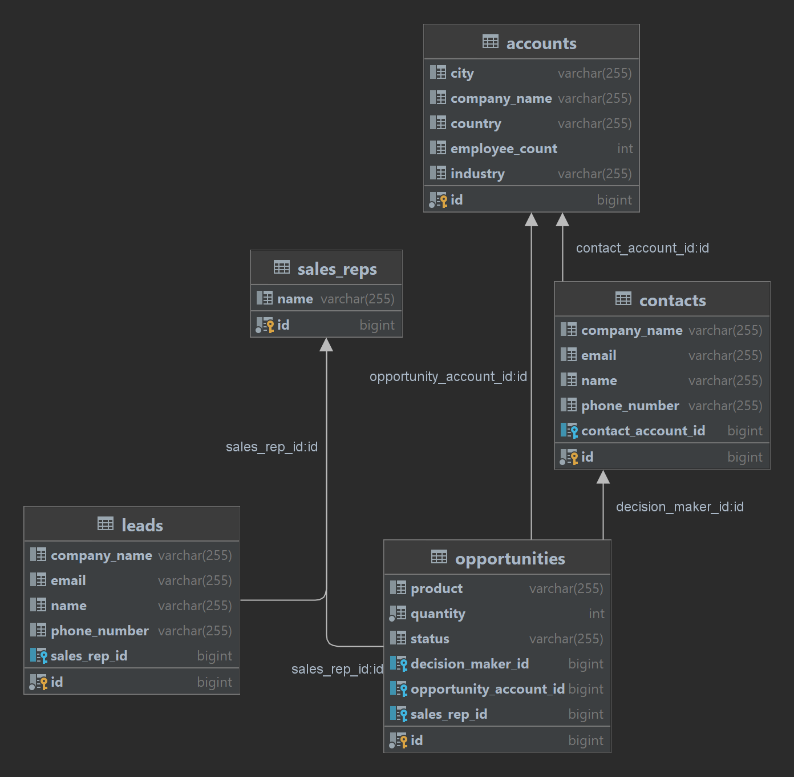

# RENUA Software CRM

### Introduction
Welcome to the RENUA Software CRM.
This is a simple CRM that allows you to manage your customers and their orders.

The entire project is controlled by keyboard commands.
When running the project, the first recommended command to use is "help", which shows all possible commands to execute.

### UML Class Diagram

### UML Use Case Diagram

### Tests

        Before run the test, please, remove or comment de line 45 from CRMStarterService
        @EventListener(value = ApplicationReadyEvent.class)

We have tested all the methods that we have considered appropriate, that means that not all methods have tests but that is for a reason.
We will not explain each case, so here are our criteria when deciding to test a method:
- That is not a constructor, a toString() or a simple getter or setter
- Not a private method
- That the method does not return a message by console.
- Do not duplicate methods, i.e. if there are two methods that return the same thing, only evaluate one.

### Diagram folders
- **Commander**: Use to handle the command lines.
- **Enums**: Use to handle the fixed values.
- **Error**: Use to handle the exception classes.
- **Model**: Use to handle the data model.
- **Repository**: Use to handle the repositories are needed to connect the services with the database.
- **Service**: Use to handle the service layer.
- **UserInput**: Use to handle the user inputs from command lines.

### How to use the software
Run the software and follow the instructions.
In the command line use *help* to see the available commands.
The basic functionalities are:
- Create a salesRep and a lead.
- Show all the salesRep, leads, contacts, opportunities and accounts saved in the database.
- Show the details of a salesRep, lead, contact, opportunity or account.
- Convert a lead to an opportunity. Then the lead is converted to a contact and the account related with the contact is also created.
- Update the status of an opportunity.
- Show salresRep reports

Using the "help" command you can find the following commands:
    
    new salesrep                         - Create a new sales rep
    show salesreps                       - Show all sales rep
    lookup salesrep :id                  - Show a sales rep by id
    new lead                             - Create a new lead
    show leads                           - Show all leads
    lookup lead :id                      - Show a lead by id
    convert :id                          - Convert a lead to a contact related with an opportunity and an account by lead id
    show contacts                        - Show all contacts
    lookup contact :id                   - Show a contact by id
    show opportunities                   - Show all opportunities
    lookup opportunity :id               - Show an opportunity by id
    show accounts                        - Show all accounts
    lookup account :id                   - Show an account by id
    close-lost :id                       - Close an opportunity as lost by id
    close-won :id                        - Close an opportunity as won by id
    report lead by salesrep              - show number of leads by salesrep
    report opportunity by salesrep       - show number of opportunities by salesrep
    report closed won by salesrep        - show number of closed won opportunities by salesrep
    report open by salesrep              - show opened number of opportunities by salesrep
    report opportunity by :attribute     - show number of opportunities by attribute, where attribute is one of the following: [the product], [city], [country], [industry]
    report closed won by :attribute      - show number of closed won opportunities by attribute, where attribute is one of the following: [the product], [city], [country], [industry]
    report open by :attribute            - show number of opened opportunities by attribute, where attribute is one of the following: [the product], [city], [country], [industry]
    report closed lost by :attribute     - show number of closed lost opportunities by attribute, where attribute is one of the following: [the product], [city], [country], [industry]
    exit                                 - Exit the program
